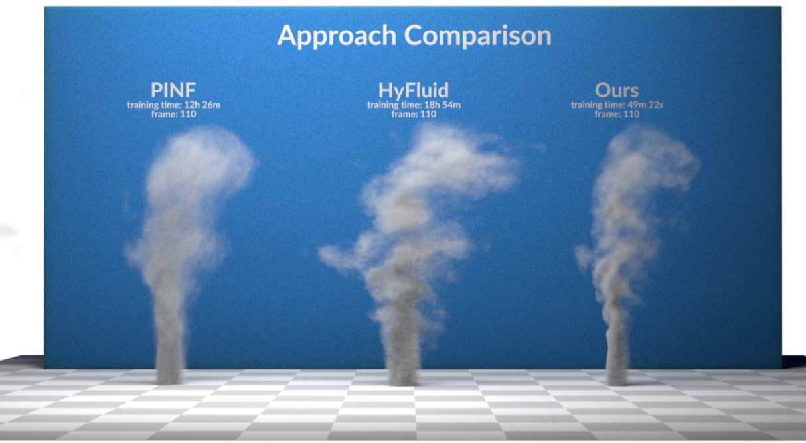

# EPINF - Efficient Physics Informed Dynamic Neural Fluid Fields Reconstruction From Sparse Videos

The pytorch implementation of the paper "EPINF - Efficient Physics Informed Dynamic Neural Fluid Fields Reconstruction From Sparse Videos"
[Paper](https://i.xayah.me/publications/EPINF/static/pdfs/[0310v3]Efficient%20Physics%20Informed%20Dynamic%20Neural%20Fluid%20Fields%20Reconstruction%20From%20Sparse%20Videos.pdf), [Project Page](https://i.xayah.me/publications/EPINF/)



## Requirements

- core
  - Python 3.13
  - torch 2.6.0 + cu126
  - numpy 2.1.2
  - scipy 1.15.2
  - scikit-image
  - tqdm 4.67.1
  - pytorch-memlab 0.3.0
- load dataset only
  - imageio 2.37.0
  - av 14.1.0
  - opencv-python 4.11.0.86
- unit tests only
  - memory_profiler 0.61.0
  - matplotlib 3.10.0
- for hyfluid only
  - taichi 1.7.3

Note: triton is required for `torch.compile`

```shell
python -m pip install --upgrade pip setuptools
python -m pip install torch torchvision torchaudio --index-url https://download.pytorch.org/whl/cu126
python -m pip install https://github.com/woct0rdho/triton-windows/releases/download/v3.2.0-windows.post10/triton-3.2.0-cp313-cp313-win_amd64.whl
```

## Train Model

```shell
python train_v.py
```

Note: you need at least 44 GB GPU memory and GPU capability >= sm86 (>=RTX 3090)
